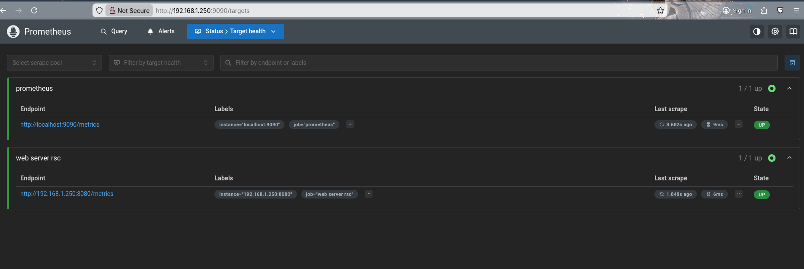

# 01/28
# Generating an SSH key pair to access and log into the server.
```bash
ssh-keygen -t ed25519 -C "capstone-lab"
```
- ssh-keygen command generates a ssh key pair for your server
- -t tells ssh what encryption method to use.
- -C tells the name of the key pair
```bash
ssh-copy-id username@server_ip_address
```
- This tells the machine to send the new public ID to the server so it knows to trust you.
# Phase 2: Install Ansible to write Ansible Playbooks.
- Ansible is an automation product that automates executing commands to host or client machines.
- Ansible uses simple, human-readable scripts called playbooks to automate your tasks. You declare the desired state of a local or remote system in your playbook. Ansible ensures the system remains in that state.
- [More Information](https://docs.ansible.com/projects/ansible/latest/getting_started/introduction.html)
## Ansible Automation.
- https://docs.ansible.com/projects/ansible/latest/getting_started/get_started_inventory.html
- In this session we will be working with ansible to push configuration (such as installing tools, dependencies) to the managed nodes using the control node (The client or remote). 
- Now instead of sshing into the web server and executing commands manually we will pushthe ansible playbook into the web server to be able to configure it from the remote node.
- To get started with Ansible, first of all we need to create an inventory.ini file which includes information about our managed node.
```bash
nvim inventory.ini
```
- Ansible has three primary environments. Control node is the remote control node that has ansible installed and you would typically use commands like ```shell ansible``` or ```shell ansible-inventory``` in order to control managed nodes. Inventory, is a list of managed nodes and includes information about the managed nodes such as their IP address and ansible_user name. Note: Considering You have set up static IP for your managed servers. Managed nodes are remote systems that ansible controls and configures.
```yaml
[webservers]
192.168.x.x ansible_user=username ansible_ssh_private_key_file=~/.ssh/PrivateKeyFile
# first the IP of the web server we are trying to control using the remote node.
# UserName of the web server we are trying to configure.
```
- **NOTE** It is much better to let ansible ssh into the managed node using a key pair than writing the password within the inventory.ini file.
- Ansible is agentless, which means you do not need to install the client software on the host as well. You can do all operations on the host using the remote node without ever installing ansible on the host machine.
- After creating the inventory.ini file, we ran ansible -i inventory.ini all -m ping
```bash
[WARNING]: Host '192.168.1.250' is using the discovered Python interpreter at '/usr/bin/python3.12', but future installation of another Python interpreter could cause a different interpreter to be discovered. See https://docs.ansible.com/ansible-core/2.20/reference_appendices/interpreter_discovery.html for more information.
192.168.1.250 | SUCCESS => {
"ansible_facts": {
"discovered_interpreter_python": "/usr/bin/python3.12"
},
"changed": false,
"ping": "pong"
}
```
- Inside of the web app file, we would need to install and initiate some dependencies before we set up our DB docker container.
- https://docs.npmjs.com/about-npm-versions
```shell
npm init -y
npm install express mysql2 bcryptjs jsonwebtoken cors dotenv
```
- Currently struggling with deploying the web app on local network!!
- OKay in order to deploy the web app on local network this is what I had to do. Update client/vite.config.js had to be changed.
```js
import { defineConfig } from 'vite'
import react from '@vitejs/plugin-react'

// https://vite.dev/config/
export default defineConfig({
plugins: [react()],
server: {
proxy: {
'/api': {
target: 'http://localhost:5000',
changeOrigin: true,
},
'/music': {
target: 'http://localhost:5000',
changeOrigin: true,
}
}
}
})
```
- Before the vite config looked like this:
```js
import { defineConfig } from 'vite'
import react from '@vitejs/plugin-react'

// https://vite.dev/config/
export default defineConfig({
  plugins: [react()],
})
```
- In this config, when the local machine tries to access the web app, because of localhost, it looks for the backend inside of local files.
- After changing the vite config reverse proxy, vite now works as a middleman. The browser sends request to api, vite looks at the request and looks at its config and redirects the request to the ubuntu server where the backend lives.
- In order to let the local network access the web server and web app, I also had to change the dev script inside of client/package.json and set the --host flag on.
```json
{
"name": "client",
"private": true,
"version": "0.0.0",
"type": "module",
"scripts": {
"dev": "npx vite --host",
"build": "vite build",
"lint": "eslint .",
"preview": "vite preview"
},
"dependencies": {
"@tailwindcss/postcss": "^4.1.18",
"axios": "^1.13.4",
"clsx": "^2.1.1",
"framer-motion": "^12.31.0",
"lucide-react": "^0.563.0",
"react": "^19.2.0",
"react-dom": "^19.2.0",
"react-router-dom": "^7.13.0",
"tailwind-merge": "^3.4.0",
"vite": "^7.3.1"
},
"devDependencies": {
"@eslint/js": "^9.39.1",
"@types/react": "^19.2.5",
"@types/react-dom": "^19.2.3",
"@vitejs/plugin-react": "^5.1.1",
"autoprefixer": "^10.4.24",
"eslint": "^9.39.1",
"eslint-plugin-react-hooks": "^7.0.1",
"eslint-plugin-react-refresh": "^0.4.24",
"globals": "^16.5.0",
"postcss": "^8.5.6",
"tailwindcss": "^4.1.18"
}
}
```
- Also setting ```json changeOrigin:true```, disables Browsers built in CORS feature. This tells vite to modify the origin to its original target, so when other machine tries to access the backend the backend server thinks the request is coming from its own machine.
- Now everytime ``shell npm run dev``` is executed this runs the script that prepares back and frontend to serve the web app:
```txt
npm run dev

> pomodorogame@1.0.0 dev
> npx concurrently "npm run start:server" "npm run start:client"

 > pomodorogame@1.0.0 start:server
 > cd server && npm run dev
 > pomodorogame@1.0.0 start:client
 > cd client && npm run dev
 > server@1.0.0 dev
 > nodemon index.js
 > client@0.0.0 dev
 > npx vite --host
```
- 
# TODO
- [] Write Ansible Playbook to conf db server, and web server and create docker containers.
```yml
---
- hosts: dbservers
tasks:
- name: Create a dir named databases
ansible.builtin.file:
path: ~/Documents/database
state: directory
tags: crdir

- name: Copying Schema.SQL to managed node
ansible.builtin.copy:
src: /home/playaow/Documents/ET4999/pomodoroGame/server/schema.sql
dest: ~/Documents/database/schema.sql
tags: cpsql

- name: Making sure python3-docker is installed
ansible.builtin.apt:
name: python3-docker
state: present
become: yes  # apt usually requires sudo
tags: py3docker

- name: Run MySQL Docker container
community.docker.docker_container:
name: mysql-db
image: mysql:latest
state: started
recreate: yes
restart_policy: always
published_ports:
- "3306:3306"
env:
MYSQL_ROOT_PASSWORD: "PASSREDACTED" # Matches your server/.env
MYSQL_DATABASE: "pomodoro_db"
volumes:
- "~/Documents/database/schema.sql:/docker-entrypoint-initdb.d/schema.sql"
tags: dkr
```
- ```shell ansible-playbook -i inventory.imi playbook.yml```
- Then we would need to manually add the databse of web app into the docker container.
```shell
docker exec -i process_id mysql -u user -p'your_db_pass' pomodoro_db < ~/Documents/pathToYourSchema.sql
```
- Now enter the container using: ```shell docker exec -it -u user -p```
- Upon prompt enter your password. and inside the container execute:
```sql
USE database_name;
SHOW TABLES;
```
- If tables are showing then the database has been succesfully imported into the MySQL database.
- Now onto the second task. Keeping the web app running on my ubuntu server even after ssh connection closes and terminal closes. (Session 02/06).
- ```txt
* https://www.youtube.com/watch?v=vFOvvUcBbNY
* https://medium.com/@bassettjosh397/how-to-deploy-a-local-server-to-the-internet-with-https-protocol-6f21ade6ad7d
* Buy a DNS name and set up its A record to point to your public IP.
* https://www.hostwinds.com/tutorials/nginx-reverse-proxy-with-ssl

```
- These two lines were added in my server/index.js file. These lines ensures whenever client tries to access the web app, these lines of code lets the client browser download html, css in the public dir of working dir.
```js
app.use(express.static(path.join(__dirname, 'public')));

app.get(/*./, (req, res) => {
res.sendFile(path.join(__dirname, 'public', 'index.html'));
});

```
- if user request a URL the API does not recognize it sends the user to index.html of the React App.
```txt
https://expressjs.com/en/starter/static-files.html
https://vite.dev/guide/build.html
https://stackoverflow.com/questions/50283111/reload-the-page-gets-404-error-using-react-router
```
- Now I am going to create a Dockerfile that will start a lightweight node image and copy everything inside of that. That should solve the problem of having the web app up even when I close the SSH connection to the webserver.
- The Docker file I created to have the app running:
```dockerfile
FROM node:18-alpine AS client-build
# Using a lightweight node image to build the frontend

# Set the working dir for the image
WORKDIR /pomodoroGame/client

# Copy package files and install all dependencies such as npm
COPY client/package*.json ./
RUN npm install

#COPY the rest of the codes inside client
COPY client/ ./

# Start npm run build to create the start/stop script
RUN npm run build

# Create another node image for the backend server
FROM node:18-alpine

# Set the working dir
WORKDIR /pomodoroGame/server

# Copy package json files from the web server
COPY server/package*.json ./
RUN npm install

# Copy everyhting else inside of server dir
COPY server/ ./

# Now we will copy the built react file into the public dir so that server/index.js works
COPY --from=client-build /pomodoroGame/client/dist ./public

# Expose the port 5000 the server is running on for the images
EXPOSE 5000

#start the app
CMD ["node", "index.js"]

```
- Source:
```txt
https://docs.docker.com/build/building/multi-stage/
```
- Run ```shell docker build -t pomodoro-game . ``` to build necessary image using the default Dockerfile inside of root folder.
- REsult:
```txt
sudo docker build -t pomodoro-game .
[sudo] password for rayhomelab:
[+] Building 208.3s (16/16) FINISHED                                          docker:default
=> [internal] load build definition from Dockerfile                                    0.3s
=> => transferring dockerfile: 981B                                                    0.0s
=> [internal] load metadata for docker.io/library/node:18-alpine                       0.6s
=> [internal] load .dockerignore                                                       0.3s
=> => transferring context: 2B                                                         0.0s
=> [internal] load build context                                                      13.9s
=> => transferring context: 816.05MB                                                  13.0s
=> CACHED [client-build 1/6] FROM docker.io/library/node:18-alpine@sha256:8d6421d663b  0.0s
=> [stage-1 2/6] WORKDIR /pomodoroGame/server                                          2.5s
=> [client-build 2/6] WORKDIR /pomodoroGame/client                                     2.7s
=> [stage-1 3/6] COPY server/package*.json ./                                          7.2s
=> [client-build 3/6] COPY client/package*.json ./                                     6.7s
=> [client-build 4/6] RUN npm install                                                144.7s
=> [stage-1 4/6] RUN npm install                                                     144.2s
=> [stage-1 5/6] COPY server/ ./                                                      20.6s
=> [client-build 5/6] COPY client/ ./                                                 28.0s
=> [client-build 6/6] RUN npm run build                                                7.7s
=> [stage-1 6/6] COPY --from=client-build /pomodoroGame/client/dist ./public           1.1s
=> exporting to image                                                                  3.1s
=> => exporting layers                                                                 2.8s
=> => writing image YOLLO  0.0s
=> => naming to docker.io/library/pomodoro-game
```
- Now we actually run the created images: ```shell docker run 5000:5000 -d pomodoro-gamev2.0```

## TODO Create CI/CD pipeline using github actions
- https://github.com/appleboy/ssh-action
- https://docs.docker.com/build/ci/github-actions/
- https://www.youtube.com/watch?v=x7f9x30W_dI
- Initialize and push the code to github.
```shell
git init
git add .
git commit -m "Comment"
git branch -M main
git push -u origin main
```
- In this case I did not have to conf git, since I already had it conf to my email and username.
- Now moving onto the actual building of CI/CD pipeline for this web deployment project.
- Create a directory inside of the root dir of web app name it .gitignore using ```shell mkdir .gitignore ```
- Inside of .github, create another dir called workflows and inside of that create deploy.yml
```YAML
name: Deploy Pomodoro Quest

on:
push:
branches:
- main

jobs:
deploy:
# CRITICAL: This tells GitHub to wait for your specific Ubuntu server to ask for the job
runs-on: self-hosted
env:
DOCKER_BUILDKIT: 0

steps:
- name: Checkout Source Code
uses: actions/checkout@v4

- name: Inject Environment Variables
run: |
echo "DB_HOST=${{ secrets.DB_HOST }}" > server/.env
echo "DB_USER=${{ secrets.DB_USER }}" >> server/.env
echo "DB_PASSWORD=${{ secrets.DB_PASSWORD }}" >> server/.env
echo "DB_NAME=${{ secrets.DB_NAME }}" >> server/.env
echo "JWT_SECRET=${{ secrets.JWT_SECRET }}" >> server/.env
echo "PORT=5000" >> server/.env

- name: Build New Docker Image
run:  docker build --no-cache -t pomodoro-prod .

- name: Stop Old Container (Ignore error if it doesn't exist)
run: docker stop pomodoro-app || true

- name: Remove Old Container (Ignore error if it doesn't exist)
run:  docker rm pomodoro-app || true

- name: Run New Container
run:  docker run --name pomodoro-app --env-file ./server/.env -p 8080:5000 -d pomodoro-prod

- name: Clean Up Unused Docker Images
run:  docker image prune -f
```
- Now before we push it on github, as we know our environment variables are not pushed into github when it was committed using git. There is no way github can know value of variables such as DB_HOST, or DB_USER etc. We go into the repo and click settings.
- Inside of setting, look for secrets and variables. From the dropdown, choose "Actions"
- Inside of Actions, click the new repo secrets button and db environment variables that are needed to connect the frontend to the backend.
- After this we need to install Github RUnner service so that github cloud can talk to the hosting machine.
- We would need the runner script which is typically given by Github.
- Go to the repo setting, and look for Actions tab on the left and from the dropdown chose runners.
- Click the green self hosted runner button, and start executing command provided..
```shell
# Create a folder
$ mkdir actions-runner && cd actions-runner
Copied!
# Download the latest runner package
$ curl -o actions-runner-linux-x64-2.333.0.tar.gz -L https://github.com/actions/runner/releases/download/v2.333.0/actions-runner-linux-x64-2.333.0.tar.gz
Copied!
# Optional: Validate the hash
$ echo "7ce6b3fd8f879797fcc252c2918a23e14a233413dc6e6ab8e0ba8768b5d54475  actions-runner-linux-x64-2.333.0.tar.gz" | shasum -a 256 -c
Copied!
# Extract the installer
$ tar xzf ./actions-runner-linux-x64-2.333.0.tar.gz
./config.sh --url https://github.com/PlayaOW/CapstoneDevOPS --token A673TLDEW2TWUWB6NI2GK43JYNLT6

```
- We also need to create a dockerignore to stop copying garbage from local machine.
- After creating the dockerfile and getting error looking at the error log, it turns out it was a problem with the older node version.
```YAML
#NEW DOCKERFILE FOR CI/CD
FROM node:22 AS client-build

WORKDIR /pomodoroGame/client

COPY client/package*.json ./

ENV npm_config_jobs=1
ENV NODE_OPTIONS=--max-old-space-size=1024

RUN npm ci

COPY client/ ./

RUN npm run build


FROM node:22

WORKDIR /pomodoroGame/server

COPY server/package*.json ./
RUN npm ci

COPY server/ ./

COPY --from=client-build /pomodoroGame/client/dist ./public

EXPOSE 5000

CMD ["node", "index.js"]
``` 
- DockerIgnore file:
```txt
node_modules
*/node_modules
npm-debug.log
.git
.env*
```
- This also takes the necessary environment variable from the .env file. These environment variables are needed to create the docker containers especially for the mysql container which need these credentials for the frontend to be able to communicate with the database server.
- The problems I came across while setting this up is problem with node and memory issues. Creating lightweight container from github actions did not work due to memory being low. Had touse medium capacity container for this to work and github actions to be able to create the docker containers.
## End of milestone, Developed End-to-End Automated Deployment. Tested and Functioning. Date:Apr 1, 2026.
[CI/CD pipeline](CDPipeLine.png)
## TODO BUY CLOUDFARE DOMAIN FOR THE WEB APP

- After completing the CI/CD pipeline I bought a Cloudfare Domain name and mapped it to my web server using cloudflared tunnel.
```shell
sudo mkdir -p --mode=0755 /usr/share/keyrings
1123  curl -fsSL https://pkg.cloudflare.com/cloudflare-public-v2.gpg | sudo tee /usr/share/keyrings/cloudflare-public-v2.gpg >/dev/null
1124  echo "deb [signed-by=/usr/share/keyrings/cloudflare-public-v2.gpg] https://pkg.cloudflare.com/cloudflared any main" | sudo tee /etc/apt/sources.list.d/cloudflared.list
1125  sudo apt-get update && sudo apt-get install cloudflared -y
1126  sudo apt update && sudo apt upgrade -y
1127  sudo apt-get install cloudfared -y
1128  sudo apt-get install cloudflared -y
1129  cloudflared tunnel login
1130  cloudflared tunnel create my-home-tunnel
1131  cloudflared tunnel route dns my-home-tunnel
1132  cloudflared tunnel route dns my-home-tunnel pomodorogame.org
1133  cloudflared tunnel run my-home-tunnel
1134  vim ~/.cloudflared/config.yml
```
- The config looks like this:
```YAML
url: http://192.168.x.x:8080
tunnel: x
credentials-file: /home/x/.cloudflared/x.json

ingress:
- hostname: pomodorogame.org
service: http://192.168.x.x:8080
- service: http_status:404
```
- I installed cloudflared service to keep the service on in the background even when SSH terminal is closed.
```shell
sudo cloudflared --config /home/rayhomelab/.cloudflared/config.yml service install
1140  sudo systemctl start cloudflared
1141  sudo systemctl enable cloudflared
1142  sudo systemctl status cloudflared
```
- Prometheus and Grafana Setup
- https://linuxconfig.org/unlock-powerful-monitoring-your-guide-to-prometheus-and-grafana
- https://prometheus.io/docs/prometheus/latest/installation/
- Prometheus.yml or prometheus conf file:
```yml
scrape_configs:
- job_name: 'prometheus'

# Adding scrape interval of 5s for dft prometheus scrape job
scrape_interval: 5s
scrape_timeout: 5s

static_configs:
- targets: ['localhost:9090']
- job_name: 'web server rsc'
scrape_interval: 10s
scrape_timeout: 10s

static_configs:
- targets: ['192.168.1.250:8080']
```
- This conf file takes default prometheus scrape jobs and scrape jobs for the web server, which lives on 192.168.1.250:8080
- Now before we create a prometheus container and run it to scrape data from our web server, we need to install prom-client and modify my index.js file to expose its data to prometheus.
- I also had to add this to my index.js
```js
const client = require('prom-client');

const app = express();

const collectDefaultMetrics = client.collectDefaultMetrics;
collectDefaultMetrics({ register: client.register });

app.get('/metrics', async (req, res) => {
try {
res.set('Content-Type', client.register.contentType);
res.end(await client.register.metrics());
} catch (ex) {
res.status(500).end(ex);
}
});

```
- After quite a lot of back and forth and configuration finally got prometheus to work:



