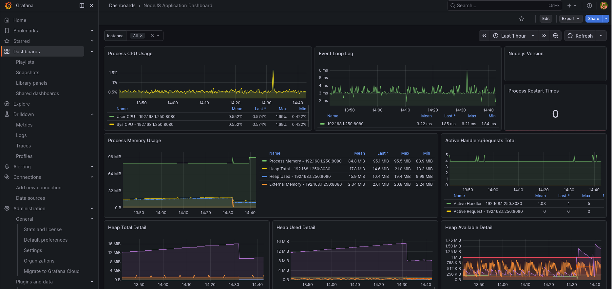
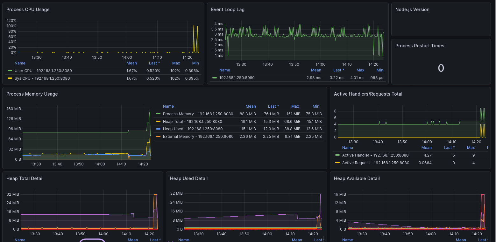

# 🚀 End-to-End Automated Deployment Pipeline (Pomodoro Quest)

## 📌 Project Overview
This project demonstrates a complete, production-ready DevOps pipeline and 3-tier web architecture. The primary objective was to eliminate manual deployment processes by engineering an automated Continuous Integration/Continuous Deployment (CI/CD) pipeline. 

Whenever new code is pushed to the `main` branch, the system automatically builds, tests, and deploys the application to a self-hosted Ubuntu server, securely exposing it to the public internet while maintaining rigorous real-time observability.

## 🛠️ Technology Stack
* **Infrastructure as Code (IaC):** Ansible
* **Containerization:** Docker, Docker Compose
* **CI/CD Automation:** GitHub Actions (Self-Hosted Runner)
* **Networking & Security:** Cloudflare Tunnels (`cloudflared`), Nginx/Vite Reverse Proxy
* **Observability & Monitoring:** Prometheus, Grafana, `prom-client`, Apache Bench
* **Application Stack:** Node.js, Express, React, Vite, MySQL

---

## 🏗️ Architecture & Implementation

### 1. Infrastructure Provisioning (Ansible)
Manual server configuration was deprecated in favor of Infrastructure as Code. Ansible playbooks were developed to securely SSH into the Ubuntu host and provision the environment. 
* Configured `inventory.ini` for secure, key-based authentication.
* Automated the installation of dependencies (e.g., `python3-docker`).
* Automated the deployment of the MySQL database container and schema initialization.

### 2. Containerization (Docker)
To solve the "works on my machine" discrepancy, the application was containerized using a multi-stage Docker build process.
* **Stage 1:** A lightweight `node:22-alpine` image compiles the React/Vite frontend.
* **Stage 2:** The built static files are transferred to the Node.js backend container, creating a single, unified, deployable image (`pomodoro-prod`).
* Implemented strict `.dockerignore` rules to optimize image weight and build times.

### 3. CI/CD Pipeline (GitHub Actions)
A self-hosted GitHub runner was configured on the Ubuntu server to handle deployments. The automated `deploy.yml` workflow triggers on every push to `main`:
1. Injects secure environment variables via GitHub Secrets.
2. Rebuilds the Docker image dynamically.
3. Gracefully stops and removes legacy containers.
4. Deploys the new container with zero manual intervention.
5. Prunes dangling images to maintain server storage hygiene.

### 4. Networking & Secure Exposure
* **Local Proxying:** Configured Vite's `server.proxy` to act as a reverse proxy, bypassing CORS restrictions and routing `/api` traffic seamlessly to the backend.
* **Public Routing:** Implemented **Cloudflare Tunnels** to expose the application to the public web (`pomodorogame.org`) securely, without opening inbound firewall ports or exposing the host's public IP address.

### 5. Observability & Monitoring Stack
A comprehensive "glass cockpit" was built to monitor the health of the Node.js event loop and host machine.
* Integrated `prom-client` into the Express backend to expose a `/metrics` endpoint.
* Configured **Prometheus** to scrape target metrics every 10 seconds.
* Built a **Grafana** dashboard to visualize time-series data, including Process CPU Usage, Active Handlers, and Heap Memory utilization.

---

## 📊 System Load Testing & Performance

To validate the architecture's resilience, a rigorous stress test was conducted utilizing **Apache Bench (`ab`)**. The server was subjected to a simulated traffic spike of 200 concurrent users.

**Test Parameters:** `ab -n 50000 -c 200 http://192.168.1.250:8080/`

**Results:**
* **Total Requests:** 50,000
* **Failed Requests:** 0
* **Requests Per Second:** 2,422.42 [#/sec]
* **Time Per Request:** 0.413 [ms] (mean, across all concurrent requests)

The containerized backend successfully handled the massive influx of traffic without crashing. The Grafana observability stack accurately captured the anticipated spikes in CPU utilization and memory allocation in real-time, proving the system is robust, scalable, and production-ready.
